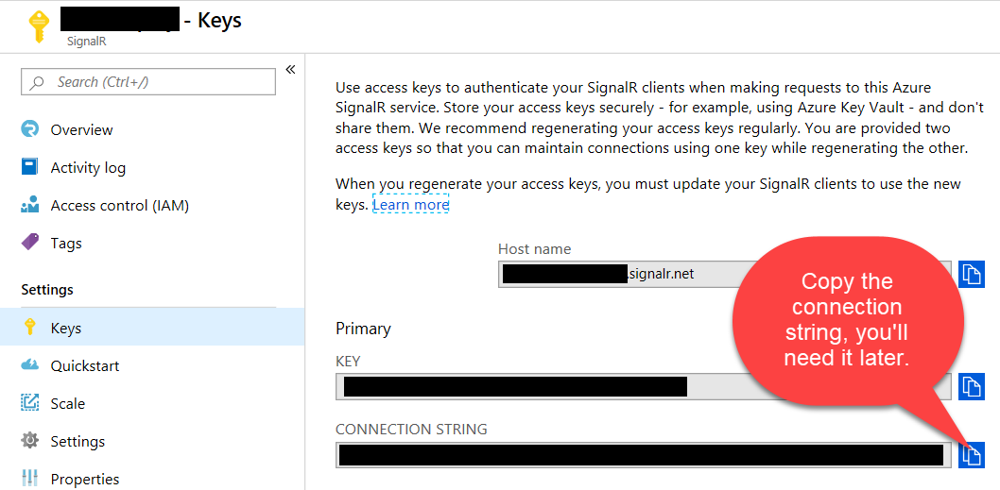

# Angular 7, Azure Functions & SignalR


## Introduction
This repro consists of two applications, an Angular 7 client and a .NET Core 2.2 Azure Functions app that uses Azure SignalR.

A backend web sever is not required or communicated with.  These apps demonstrate Angular communicating directly with Azure Functions.

I learned a lot from these two applications:

- [GrillPhil ServerlessRealtimeDemo](https://github.com/GrillPhil/ServerlessRealtimeDemo)

- [SibeeshVenu Realtime-IoT-Device-Data-using-Azure-SignalR-and-Azure-Function-in-Angular](https://github.com/SibeeshVenu/Realtime-IoT-Device-Data-using-Azure-SignalR-and-Azure-Function-in-Angular/tree/master/AzureFunction/AzureFunction)

Since these apps were written new API's have come out and Angular has been updated.  This app reflects Angular 7 and the newer SignalR NuGet packages published by Microsoft in Feb 2019.

## Prerequisites
- Server Application: Visual Studio 2019 with the Azure Development Workload installed.  Visual Studio 2019 for the Mac will probably work, I've just not tested it.

- Client Application: Standard Angular 7 tooling setup, editor of your choice.

## Training Video
Please watch my YouTube [Angular Azure Functions and SignalR Video](https://www.youtube.com/watch?v=pbmglrQvmwA&feature=youtu.be)

I give an in depth walk-through of the running application, server code, and client code.

## Let's Get Started

### Create Azure SignalR Service

1. Create an Azure SignalR Service instance in the Azure Portal. Go to Keys and note the connection string, you'll need this later.



### Azure Functions (SignalRServer) App
1. Clone or download this repo.
2. Open the SignalRServer solution in Visual Studio.
3. Add a local.settings.json file to the SignalRServer project.
4. Open the local.settings.json file and paste this json into the file.
5. Replace the below AzureSignalRConnectionString with the connection string you copied from the Azure Portal Keys blade.

```json
{
  "IsEncrypted": false,
  "Values": {
    "AzureWebJobsStorage": "UseDevelopmentStorage=true",
    "AzureWebJobsDashboard": "UseDevelopmentStorage=true",
    "AzureSignalRConnectionString": "Endpoint=INSERT_YOUR_SIGNALRSERVICE_ENDPOINT_HERE;"
  },
  "Host": {
    "LocalHttpPort": 7071,
    "CORS": "*"
  }
}
```
6. Start Debugging

### Angular Client (Client) App
Note: Please watch the above YouTube video if you have not watched it.

1. From the Client folder, run npm install, this will install all dependencies.
2. Run ng serve, this will start a local test server and open your default browser open http://localhost:4200.
3. Open a second or more browser windows and navigate to http://localhost:4200.
4. Register a unique user name for each browser instance.
5. Start sending messages to all user or to an individual user.


