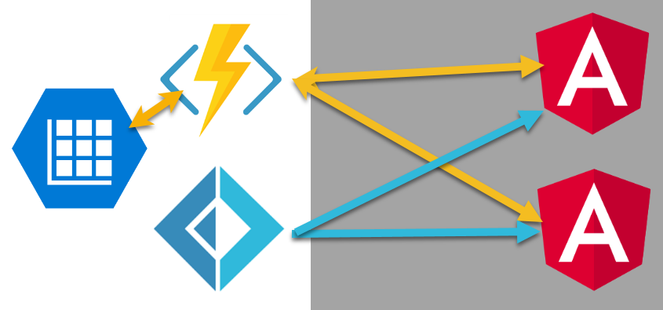

# Angular 7 - Azure Functions - SignalR - Custom Authorization


## Introduction
This repro consists of two applications, an Angular 7 client and a .NET Core 2.2 Azure Functions app that uses Azure SignalR.

A backend web sever is not required or communicated with to load the website or flow messagees to and from the Azure services.  These apps demonstrate Angular communicating directly with Azure Functions and authenticating using custom authentication.

I learned a lot from these posts:

- [GrillPhil ServerlessRealtimeDemo](https://github.com/GrillPhil/ServerlessRealtimeDemo)

- [SibeeshVenu Realtime IoT Device Data using Azure SignalR and Azure Function in Angular](https://github.com/SibeeshVenu/Realtime-IoT-Device-Data-using-Azure-SignalR-and-Azure-Function-in-Angular/tree/master/AzureFunction/AzureFunction)

- [Erik Andreas Azure Functions SignalR Authentication Using Imperative Binding](https://gist.github.com/ErikAndreas/72c94a0c8a9e6e632f44522c41be8ee7)

- [Dynamic Binding in Azure Functions with Imperative Bindings](http://dontcodetired.com/blog/post/Dynamic-Binding-in-Azure-Functions-with-Imperative-Runtime-Bindings)

- [Ben Morris Custom Token Authentication In Azure Functions](https://www.ben-morris.com/custom-token-authentication-in-azure-functions-using-bindings/)

Some of the above posts were authored before the latest SignalR client NuGet packages came out. This app reflects Angular 7 and the newer SignalR NuGet packages published by Microsoft in Feb 2019.

## Prerequisites
- Server Application: Visual Studio 2019 with the Azure Development Workload installed.  Visual Studio 2019 for the Mac will probably work, I've just not tested it.

- Client Application: Standard Angular 7 tooling setup, editor of your choice.

## Training Videos
Please watch my YouTube Video Series Angular 7 - Azure Functions - SignalR - Custom Authorization.  You can open the playlist or view the videos individually.

[Playlist For Angular Azure SignalR Custom Authentication](https://www.youtube.com/playlist?list=PLFZfBw9eNzgzojmcvLlO0a0gw-n6sdInd)

[1. Azure SignalR, Source Code Installing, Configuring, and Running The Applications](https://www.youtube.com/watch?v=YXUAfI0gMXo&feature=youtu.be)

[2.Seeding The Database](https://www.youtube.com/watch?v=i31Ugbu6QXc&feature=youtu.be)

[3. Logging Into Azure Application Using Custom Authentication](https://www.youtube.com/watch?v=e3Fg1I3KZKM&feature=youtu.be)

[4. Getting A SignalR JWT and Start Client SignalR Hub](https://www.youtube.com/watch?v=VW7VzlzLDG4&feature=youtu.be)

[5. Sending SignalR Messages To One Or More Client Applications](https://www.youtube.com/watch?v=OWMBQ-nBrQI&feature=youtu.be)

[6. Deep Dive - SignalRConnectionInfo & IBinder Output Binding](https://www.youtube.com/watch?v=eOnrsdL33Fw&feature=youtu.be)

[7. Deep Dive - Custom Authentication - Gatekeeper - Token Tools](https://www.youtube.com/watch?v=wrynKZe_qUU&feature=youtu.be)

## Let's Get Started

### Create Azure SignalR Service

[What is Azure SignalR Service?](https://docs.microsoft.com/en-us/azure/azure-signalr/signalr-overview)

[Create an Azure SignalR Service Instance](https://docs.microsoft.com/en-us/azure/azure-signalr/signalr-quickstart-azure-functions-csharp)

1. Create an Azure SignalR Service instance in the Azure Portal. Go to Keys and note the connection string, you'll need this later.


### Azure Functions (SignalRServer) App
1. Clone or download this repo.
2. Open the SignalRServer solution in Visual Studio.
3. Add a local.settings.json file to the SignalRServer project.
4. Open the local.settings.json file and paste this json into the file.
5. Replace the below AzureSignalRConnectionString with the connection string you copied from the Azure Portal Keys blade.

```json
{
  "IsEncrypted": false,
  "Values": {
    "AzureWebJobsStorage": "UseDevelopmentStorage=true",
    "AzureWebJobsDashboard": "UseDevelopmentStorage=true",
    "AzureSignalRConnectionString": "Endpoint=INSERT_YOUR_SIGNALRSERVICE_ENDPOINT_HERE;"
  },
  "Host": {
    "LocalHttpPort": 7071,
    "CORS": "*"
  }
}
```
6. Start Debugging

### Angular Client (Client) App
Note: Please watch the above YouTube video if you have not watched it.

1. From the Client folder, run npm install, this will install all dependencies.
2. Run ng serve, this will start a local test server and open your default browser open http://localhost:4200.
3. Open a second or more browser windows and navigate to http://localhost:4200.
4. Using the UI:
- Seed The Database
- Login
- Start SignalR Client
- Start sending messages to all user or to an individual user.
